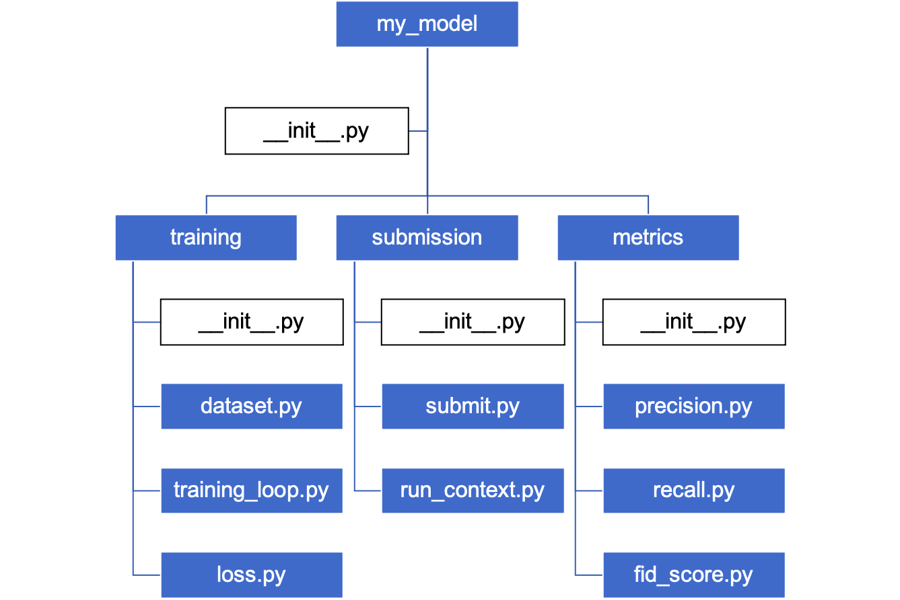

# Day 6: Python Packages, Modules, and File Handling

## 📌 Topics Covered:
- Packages and Modules in Python
- Structure of a Package (with Image Representation)
- Installing and Using Third-Party Packages
- Creating and Importing Packages and Modules
- Python I/O and File Handling
  - Reading from and Writing to Files
  - Opening Files

---

## 📦 Packages and Modules in Python

### 🔹 What is a Module?
A **module** in Python is a file containing Python code (functions, classes, variables, etc.) that can be reused in other programs.

**Example:**
```python
# mymodule.py

def greet(name):
    return f"Hello, {name}!"
```

To use this module in another script:
```python
import mymodule
print(mymodule.greet("Sanika"))
```

### 🔹 What is a Package?
A **package** is a collection of modules organized in directories, making it easier to manage and distribute.

#### 📌 Structure of a Python Package:
```
my_package/  # Package Name
│-- __init__.py  # Required to make it a package
│-- module1.py
│-- module2.py
```

### 🖼️ Structure Representation:


---

## 📥 Installing and Using Third-Party Packages

Python provides **pip**, a package manager to install third-party libraries from [PyPI](https://pypi.org/).

🔹 **Installing a Package**:
```sh
pip install requests
```
🔹 **Using an Installed Package**:
```python
import requests
response = requests.get("https://api.github.com")
print(response.status_code)
```

---

## 📌 Creating and Importing Packages and Modules

### ✅ Creating a Package:
1. Create a directory (folder) with the package name.
2. Add an `__init__.py` file (can be empty or contain initialization code).
3. Add module files inside the directory.

**Example:**
```
math_operations/
│-- __init__.py
│-- addition.py
│-- subtraction.py
```

**addition.py**:
```python
def add(a, b):
    return a + b
```

**Importing a Module from a Package:**
```python
from math_operations.addition import add
print(add(5, 3))
```

---

## 📂 Python I/O and File Handling

Python provides built-in functions to work with files.

### 🔹 Opening a File
```python
file = open("example.txt", "r")  # 'r' for read mode
```

### 🔹 Reading from a File
```python
content = file.read()
print(content)
file.close()
```

### 🔹 Writing to a File
```python
file = open("example.txt", "w")  # 'w' for write mode
file.write("Hello, Python!")
file.close()
```

### 🔹 Using `with` Statement (Recommended)
```python
with open("example.txt", "r") as file:
    content = file.read()
    print(content)  # File closes automatically
```

---

## 📌 Summary
✅ Python modules and packages help in organizing code.
✅ Third-party packages can be installed using pip.
✅ Python provides simple functions for file handling operations.

🔗 Keep Learning & Keep Coding! 🚀 

